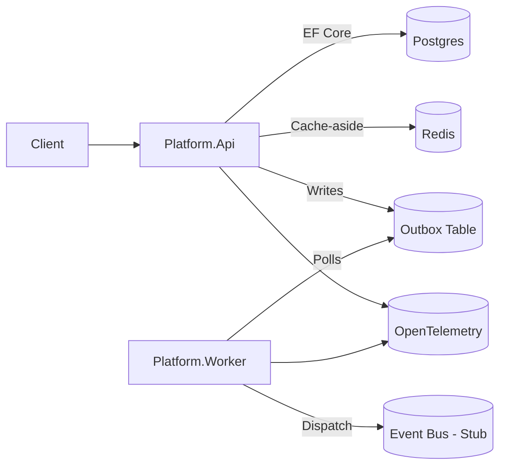

# Architecture

## Platform architecture

```mermaid
flowchart LR
  Client --> API[Platform.Api]
  API -->|EF Core| PG[(Postgres)]
  API -->|Cache-aside| Redis[(Redis)]
  API -->|Writes| Outbox[(Outbox Table)]
  Worker[Platform.Worker] -->|Polls| Outbox
  Worker -->|Dispatch| Events[(Event Bus - Stub)]
  API --> OTel[(OpenTelemetry)]
  Worker --> OTel
```
